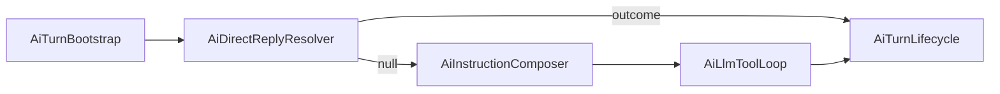

# План: AI-платформа ERP (ассистенты, skills, gateway)

> **Операционная документация (актуальное поведение):** `erp.local/docs/domains/ai/README.md` (агенты, skills, чат, аудит, troubleshooting). Этот файл — дорожная карта; при расхождении с кодом приоритет у операционного гайда в `erp.local`.

## Цель

Встроить в ERP **платформенный слой AI-сотрудников**: gateway к LLM, skills в БД, профили агентов, переписки (drawer, позже Telegram/OpenClaw), audit runs/tool_calls. AI — **отдельный bounded context**, не фича CRM.

**MVP продукта:** ассистент задач в правом drawer + LLM (оркестратор) + skills `tasks.list_my`, `tasks.create`; admin UI skills/агентов.

## Зависимости

| Этап | Статус | Документ |
|------|--------|----------|
| Credentials по компании (LLM keys) | Реализовано | [tenant-external-credentials-plan.md](tenant-external-credentials-plan.md) |
| Контракты tool-calling | Зафиксировано | `erp.local/docs/programs/client-api/ai-call-tools-preliminary.md` |
| Drawer-чат (UI + API conversations) | Реализовано (MVP) | [internal-messaging-chat-plan.md](internal-messaging-chat-plan.md) |
| Communications (транспорт) | Реализовано | `erp.local/docs/domains/communications/communications-foundation.md` |

## Принятые архитектурные решения (ADR)

### Chat vs event ingress

| Путь | Вход | Оркестрация |
|------|------|-------------|
| Drawer (чат) | `POST /ai/conversations/{id}/messages` | `AiConversationService::appendUserMessage` → `AiOrchestratorService::processTurn` (sync по умолчанию) |
| Событие (задача synthetic) | `TaskAssignedToSyntheticUser` → `DispatchAgentTurnOnTaskAssignedToSynthetic` | `AiTurnDispatcher` → `ProcessAiAgentTurnJob` (async) → `runTurn` / `processTurn` |

Единая точка оркестрации — `AiOrchestratorService::processTurn`. `AiTurnDispatcher` маршрутизирует event-path и async drawer (`AI_SYNC_TURNS=false`). Realtime: `AiConversationMessageAppended` (Reverb).

### workflow_id (UUID без FK)

`tasks.workflow_id` и `ai_runs.workflow_id` — UUID корреляции, **без FK** на `ai_workflows.correlation_id` (порядок миграций и soft-связь). Связь устанавливается в `AiWorkflowContext::startOrResume` при turn. Таблица `ai_workflow_steps` — фаза H (запись steps не в MVP).

### Synthetic permissions (Spatie team)

Филиал прав: `AiPermissionsBranchResolver` (корневой department → любой department). Используется при provision (`AiSyntheticEmployeeProvisioner`) и runtime tools (`AiAgentActorResolver`). `permissions_branch_id` на профиле — override.

Событие `TaskAssignedToSyntheticUser` только если `AiAgentRegistry::bySyntheticUserId` нашёл профиль (не любой `is_system`). Guard event-loop: `CreateTaskDTO::suppress_agent_turn` в skill `tasks.create`.

### Orchestrator pipeline (Phase A)

`AiOrchestratorService::processTurn` — тонкий facade. Внутренний pipeline:



| Компонент | Путь | Ответственность |
|-----------|------|-----------------|
| Bootstrap / lifecycle | `Orchestration/Turn/` | `AiRun`, workflow, persist assistant message |
| Direct reply | `Orchestration/DirectReply/` | Стратегии без LLM (`SmallTalk`, `TaskList`); registry в `AppServiceProvider` |
| Instruction compose | `Orchestration/Instructions/` | Playbook по trigger → system context (фаза IS) |
| LLM loop | `Orchestration/Llm/` | Итерации gateway + tool calls |
| Tool execution | `AiToolCallExecutor` | Skill handlers + audit `ai_tool_calls` |

Правила расширения: новая direct-логика → `AiDirectReplyStrategyInterface` + запись в `AiDirectReplyStrategyRegistry`; instruction playbook → `Orchestration/Instructions/` ([ai-instruction-skills.md](ai-instruction-skills.md)); новая LLM-политика → `Orchestration/Llm/`; audit run/message → `Turn/`.

### Монолит, не packages

- Один репозиторий, один deploy.
- Код: `App\Services\AI\`, `App\Models\AI\`, `App\Http\Controllers\AI\` — **не** `packages/ai-*`, **не** `app/Modules/AI`.
- `App\Services\Platform\` — только кросс-тенантный ops; AI для всех тенантов в `App\Services\AI\`.

### Префикс таблиц `ai_*`

Единый префикс для платформы: агенты, skills, conversations, messages, runs, tool_calls.

**Не использовать:** `internal_*`, generic `conversations`, `messaging_*` (на текущем этапе).

Human DM позже: `ai_conversations.kind = employee_dm`, без нового префикса.

### Skills в БД + PHP handlers

- Метаданные и JSON Schema — в `ai_skills` / `ai_skill_versions`.
- **Tool skills** (`kind = tool`): исполнение — `SkillHandlerInterface` → доменный `Service`; LLM вызывает function tool.
- **Instruction skills** (`kind = instruction`): playbook/trigger → composed system prompt в оркестраторе; без handler. Детали — [ai-instruction-skills.md](ai-instruction-skills.md) (BL-06, фазы IS-1..IS-3).
- LLM **не** вызывает Eloquent доменов напрямую.

### Границы доменов

| Домен | Роль |
|-------|------|
| `external_credentials` | Ключи и `meta.base_url` (OpenClaw и др.) |
| `communications_*` | Доставка SMS/email/Telegram; не чат сотрудника |
| `ai_*` | Диалоги, агенты, skills, orchestration, audit |
| ERP API + Policies | Источник истины для бизнес-действий |

### UI vs БД

В интерфейсе допустимо «Ассистент» / «Сообщения»; в схеме и API — префикс `ai/`.

## Целевая схема (кратко)

Порядок миграций (отдельный `*_create_*_table.php` на таблицу):

1. `ai_skills`
2. `ai_skill_versions`
3. `ai_agent_profiles`
4. `ai_agent_skills`
5. `ai_conversations`
6. `ai_conversation_participants`
7. `ai_conversation_messages`
8. `ai_runs`
9. `ai_tool_calls`

Ключевые поля — см. раздел «Фаза A» ниже; полная схема skills — в комментариях к миграциям при реализации.

## Структура кода

```text
app/Services/AI/
  Gateway/           # LLM providers, token usage
  Orchestration/     # run loop, context
  Skills/            # registry (DB), executor, Handlers/
  Agents/            # profiles, resolver
  Conversations/     # threads, messages
  Channels/          # Telegram, drawer ingress
  Memory/            # RAG — позже (интерфейс + stub)

app/Models/AI/
app/DTO/AI/
app/Enums/AI/
app/Policies/AI/
app/Http/Controllers/AI/
app/Jobs/AI/
app/Events/AI/
app/Support/AI/
```

**API:** префикс `ai/`, middleware: `auth:sanctum`, `refine-tenant-context`, `branches`.

Примеры маршрутов:

- `GET|POST ai/conversations`
- `GET|POST ai/conversations/{id}/messages`
- `GET|POST|PUT ai/agent-profiles` (admin)
- `GET|POST|PUT ai/skills`, `POST ai/skills/{id}/publish` (фаза D)

## Дорожная карта

### Фаза A — MVP drawer + stub + skills-каркас

**Результат:** drawer, персистентные треды, stub-ответ, skills в БД, handlers на Task (без LLM).

- Миграции `ai_*` (9 таблиц).
- Сидеры: system skills `tasks.list_my`, `tasks.create`; default agent на компанию.
- RBAC: entities `ai_conversations`, `ai_agent_profiles`, `ai_skills`.
- `AiConversationService`, stub в `appendUserMessage`.
- `AiSkillRegistry`, `AiSkillExecutor`, 2 task handlers.
- Frontend: `center-ai-chat.vue`, `useCenterPanels`.
- Feature tests: tenant isolation, policies.

Детальный чеклист UI/API — [internal-messaging-chat-plan.md](internal-messaging-chat-plan.md).

### Фаза B — Gateway + Orchestrator

- `LlmProviderInterface`, OpenAI-compatible provider, `ExternalCredentialResolver`.
- `AiOrchestratorService` вместо stub; `ProcessAiTurnJob`.
- `ai_runs`, `ai_tool_calls` при каждом turn.
- Приёмка: «мои задачи», «создай задачу» через LLM.

### Фаза C — UX

- Cursor-пагинация истории, Reverb для готовых сообщений (см. [бэклог](ai-assistent-backlog.md) BL-01 — streaming токенов LLM).

### Фаза D — Admin skills

- CRUD/publish skills, cache invalidation.

### Фаза E — Telegram

- `AiTelegramIngressService` + хук в [TelegramWebhookUpdateService](../../app/Services/Communications/Providers/Telegram/TelegramWebhookUpdateService.php) / [ProcessTelegramUpdateJob](../../app/Jobs/Communications/ProcessTelegramUpdateJob.php).
- Документация dev: `erp.local/docs/infrastructure/queue-workers-dev.md`, `erp.local/docs/domains/communications/telegram-bot-provider.md`.

### Фаза F — Memory / RAG

- Отдельное хранилище векторов; не MySQL.

### Фаза G — Skills: лиды (запланировано)

- Подсчёт лидов на дату, поиск **активного** лида (без `sale_orders.status = confirmed`).
- Детальный план: [ai-leads-skills-plan.md](ai-leads-skills-plan.md).

### Фаза IS — Instruction Skills (запланировано)

- Playbook-слой: trigger + instruction body → system context; `kind` на `ai_skills`, без отдельных таблиц.
- Врезка в pipeline: после `DirectReply`, до `AiLlmToolLoop`.
- Детальный план: [ai-instruction-skills.md](ai-instruction-skills.md) (бэклог BL-06).

## Фаза A: колонки MVP (справочник для миграций)

**`ai_skills`:** `code` (unique), `name`, `description`, `domain`, `handler_type`, `handler_reference`, `risk_level`, `is_active`, `is_system`, `company_id` nullable, timestamps.

**`ai_skill_versions`:** `ai_skill_id`, `version`, `input_schema` json, `published_at`, timestamps.

**`ai_agent_profiles`:** `company_id`, `code`, `name`, `synthetic_user_id` nullable, `llm_credential_id` nullable FK, `default_model`, `model_settings` json, `system_prompt`, `is_default`, timestamps.

**`ai_agent_skills`:** `ai_agent_profile_id`, `ai_skill_id`, `ai_skill_version_id` nullable, `is_enabled`.

**`ai_conversations`:** `company_id`, `kind`, `ai_agent_profile_id`, `created_by_user_id`, `title`, `channel`, `channel_external_id`, `archived_at`, timestamps.

**`ai_conversation_participants`:** `ai_conversation_id`, `user_id`, `role`.

**`ai_conversation_messages`:** `author_type`, `author_user_id`, `body`, `metadata` json, `delivery_source`, `external_id`, timestamps.

**`ai_runs`:** `company_id`, `ai_agent_profile_id`, `ai_conversation_id`, `status`, `trigger`, `correlation_id`, token fields, `error_code`, `started_at`, `finished_at`.

**`ai_tool_calls`:** `ai_run_id`, `ai_skill_id`, `ai_skill_version_id`, `input`, `output`, `status`, `duration_ms`, `error_code`.

## Правила реализации

- Backend сущностей: [rules-for-creating-new-entity-guide.md](rules-ai/backend/rules-for-creating-new-entity-guide.md)
- Vue drawer/компоненты: [rules-for-vue-component.md](rules-ai/frontend/rules-for-vue-component.md)
- Миграции: править исходные create-файлы, перекат `php artisan migrate --seed`
- Инварианты проекта: [project-context.md](rules-ai/project-context.md)

## Трек исполнения (сводный)

_Актуализировано: 2026-05-19._

- [x] **A.1** Миграции `ai_*` (9 таблиц)
- [x] **A.2** Модели, enums, policies, seeders, entities в `EntitiesTableSeeder`
- [x] **A.3** Services, routes, conversations API (оркестратор вместо stub)
- [x] **A.4** Task skill handlers + registry (`tasks.list_my`, `tasks.create`)
- [x] **A.5** Drawer frontend (`center-ai-chat.vue`)
- [x] **A.6** Feature tests (conversations, policies, LLM)
- [x] **B** Gateway + Orchestrator + LLM + `ai_runs` / `ai_tool_calls` (sync по умолчанию; async drawer `AI_SYNC_TURNS=false`; event-path через `ProcessAiAgentTurnJob`)
- [x] **C** Cursor-пагинация + Reverb (`AiConversationMessageAppended`)
- [x] **D** Admin skills/agents API + Vue (index/edit по эталону `CommonsPageEdit`)
- [x] **D.*** `forgetSkillCache` при publish; `AiSkillPermissionResolver`; sync system skills (`POST agent-profiles/{id}/sync-system-skills`)
- [x] **E** Telegram ingress + `UserActingContext`
- [ ] **F** Memory / RAG
- [ ] **G** Skills: лиды — [ai-leads-skills-plan.md](ai-leads-skills-plan.md)
- [ ] **IS** Instruction Skills — [ai-instruction-skills.md](ai-instruction-skills.md) (IS-1 [x], IS-2..3 открыты)

### Фаза I — Надёжность чата и ops (2026-05)

- [x] **I.1** Catalog API `GET ai/agent-profiles/catalog` (drawer без admin-прав на `agent-profiles`)
- [x] **I.2** Idempotency `client_message_id` на `ai_conversation_messages` (replay по `trigger_message_id`)
- [x] **I.3** Ops UI + API `ai/runs` (read-only index/show + `ai_tool_calls`)

### Открытые темы (бэклог)

Следующие пункты **намеренно не в текущем scope**; детализация, приоритеты и ID задач — в **[ai-assistent-backlog.md](ai-assistent-backlog.md)**:

- **Streaming LLM** в drawer (BL-01) — остаётся открытым
- **Полная observability** — structured logs / метрики (BL-02) — остаётся открытым
- Фазы **F**, **G**, **H** и прочие отложенные задачи — см. тот же бэклог

## Связанные документы

- [ai-assistent-backlog.md](ai-assistent-backlog.md) — бэклог будущих задач (streaming, observability, workflow steps, …)
- [ai-instruction-skills.md](ai-instruction-skills.md) — instruction skills (playbook, фазы IS-1..IS-3)
- [internal-messaging-chat-plan.md](internal-messaging-chat-plan.md) — UI drawer, этапы M.* внутри фазы A
- [ai-leads-skills-plan.md](ai-leads-skills-plan.md) — skills лидов (фаза G)
- [tenant-external-credentials-plan.md](tenant-external-credentials-plan.md)
- [ai-call-tools-preliminary.md](../programs/client-api/ai-call-tools-preliminary.md)

## История

Ранний черновик (диалог с внешним архитектурным консультантом, варианты `packages/ai-*`, `internal_*`) **заменён** этим документом (2026-05-18). Источник истины — данный файл и [internal-messaging-chat-plan.md](internal-messaging-chat-plan.md).
