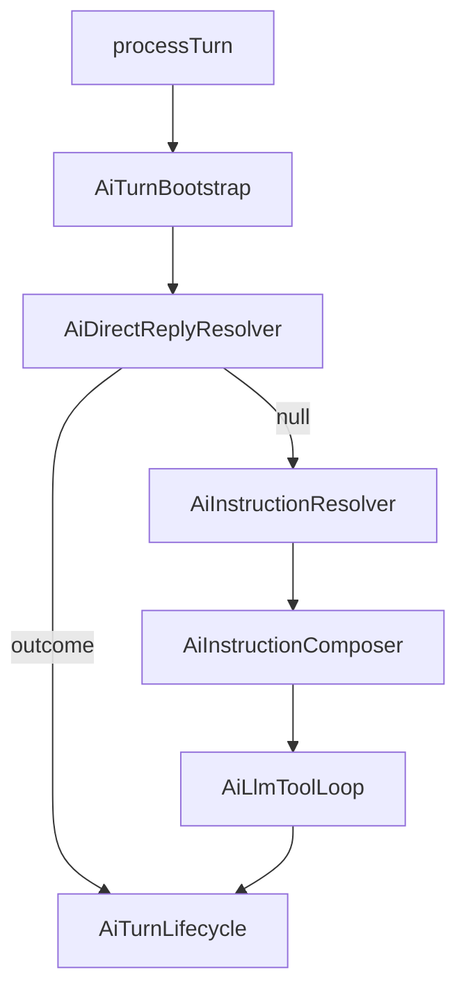

# План: Instruction Skills (политики поведения агента)

Документ описывает **instruction skill** — декларативный, версионируемый playbook для AI-агента: *как* отвечать, *когда* применять сценарий, *какие* tool-skills допустимы в turn. Это **не** замена functional skills (tool + PHP handler) и **не** свободный prompt editor.

**Связанные документы:**

- [ai-assistent-plan.md](ai-assistent-plan.md) — общая AI-платформа, orchestrator, фазы A–I
- [ai-assistent-backlog.md](ai-assistent-backlog.md) — бэклог (BL-06)
- [ai-call-tools-preliminary.md](../programs/client-api/ai-call-tools-preliminary.md) — контракт tool-calling

---

## 1. Проблема

Сейчас поведение агента распределено между:

| Механизм | Где | Ограничение |
|----------|-----|-------------|
| `AiAgentProfile.system_prompt` | Профиль агента | Один монолитный текст на агента |
| `lang/ru/ai.php` → `tools_usage_hint` | Код | Нужен деплой для изменения |
| `DirectReply` strategies | PHP-классы | Детерминизм, но не редактируется из UI |
| Tool skill `description` | `ai_skills` | Только подсказка при выборе tool, не playbook |

Для multi-tenant ERP нужен слой: **версионируемые сценарии ответа**, привязка к агенту, audit, без дублирования каталога skills и без «giant_prompt_v57.txt».

---

## 2. Цели и non-goals

### Цели (MVP → расширение)

1. Админ создаёт **instruction skill** в UI: trigger + текст инструкции + publish.
2. При turn оркестратор **выбирает** подходящий instruction и **подмешивает** его в system context.
3. LLM отвечает **без обязательного tool call**, если сценарий этого не требует.
4. В `ai_runs` фиксируется, **какой instruction** сработал (observability).
5. Один каталог `ai_skills`, один UI, одна привязка `ai_agent_skills`.

### Non-goals (не в первых фазах)

- AI Marketplace / install pack ассистентов
- Low-code workflow designer (фаза H — отдельно)
- Замена Spatie policies и PHP guard’ов текстом instruction
- Embedding-router / отдельный classifier-микросервис (фаза IS-2+)
- Отдельные таблицы `ai_instruction_skills_*`

---

## 3. Определение

> **Instruction skill** — skill с `kind = instruction`: декларативная политика turn’а (playbook), которая в runtime формирует **дополнительный system context** и опционально **ограничивает набор tool-skills**. Исполнение — в оркестраторе (`AiInstructionComposer`), не через OpenAI function call.

> **Tool skill** (functional) — skill с `kind = tool`: OpenAI function + `SkillHandlerInterface` + audit `ai_tool_calls`. Без изменений по текущей модели.

```text
Agent
 ├── system_prompt          (персона, глобально на агента)
 ├── Instruction Skills     (playbook по сценарию / trigger)
 └── Tool Skills            (действия и данные ERP)
```

---

## 4. ADR (архитектурные решения)

### ADR-IS-1: Один каталог — поле `kind` на `ai_skills`

**Решение:** не создавать `ai_instruction_skills`. Расширить существующие `ai_skills` / `ai_skill_versions` / `ai_agent_skills`.

**Почему:**

- Единый admin UI, RBAC (`ai_skills`), versioning, tenant (`company_id`)
- Одна привязка к агенту
- Меньше дублирования кода и миграций

**Enum:** `AiSkillKindEnum`: `tool` | `instruction` (default `tool` для обратной совместимости).

### ADR-IS-2: Instruction — executable policy object, не textarea

Instruction skill хранит **структурированный конфиг** (JSON в версии), из которого runtime собирает prompt и policy. Свободный многостраничный prompt без схемы **запрещён** в UI (только поля с валидацией).

Минимальная схема MVP:

```json
{
  "instruction_body": "Отвечай по регламенту отдела продаж…",
  "trigger": {
    "type": "keywords",
    "patterns": ["лид", "клиент", "сделк"]
  }
}
```

Расширения (фаза IS-2+): `allowed_tool_codes`, `priority`, `exclusive`, `response_format`.

### ADR-IS-3: Слоистая композиция system context

Порядок слоёв (снизу вверх — последний не перебивает security):

```text
1. Platform core          (неизменяемо tenant’ом; lang/ai.php)
2. Security guardrails    (неизменяемо tenant’ом; запреты, tenant isolation hints)
3. Agent system_prompt    (персона агента)
4. Matched instructions   (0..N playbook’ов текущего turn)
5. Tool usage hints       (platform или instruction; см. миграцию с tools_usage_hint)
6. Dynamic runtime context (дата, user, branch — позже)
```

**Правило:** instruction **дополняет**, не заменяет platform/security слои.

### ADR-IS-4: Место в orchestrator pipeline

Instruction resolution — **после** `DirectReply`, **до** `AiLlmToolLoop`:



**Почему после DirectReply:** детерминированные shortcuts (small talk, task count) остаются дешёвыми и не зависят от LLM routing.

**Почему до LLM loop:** instruction влияет на system prompt и (в IS-2) на фильтр `openAiTools` до первого вызова gateway.

### ADR-IS-5: Безопасность остаётся в PHP

Instruction может **рекомендовать** поведение («не удаляй клиентов»), но:

- `AiSkillPermissionResolver`, Policies, `risk_level`, tenant scope — **источник истины**
- Instruction **не может** ослабить права или обойти handler whitelist
- `allowed_tool_codes` — только **сужение** набора tools агента, не расширение

### ADR-IS-6: OpenClaw / Telegram — только ingress

Instruction runtime живёт в `App\Services\AI\Orchestration\`. Каналы не хранят business playbooks.

---

## 5. Модель данных

Изменения — в **исходных** миграциях (`*_create_*`), rollback → правка → `migrate --seed`.

### `ai_skills`

| Поле | Изменение |
|------|-----------|
| `kind` | `string`, default `tool` — `tool` \| `instruction` |
| `handler_type` | nullable (только для `kind=tool`) |
| `handler_reference` | nullable (только для `kind=tool`) |

Validation (Request/DTO): для `instruction` handler-поля не требуются; для `tool` — как сейчас.

### `ai_skill_versions`

| Поле | Изменение |
|------|-----------|
| `input_schema` | nullable (только для `kind=tool`) |
| `instruction_config` | `json`, nullable — trigger, body, allowed_tools, … |
| `prompt_hint` | **deprecated** → перенос в `instruction_config.instruction_body` при seed/migrate данных |

Структура `instruction_config` (версионируется):

```json
{
  "instruction_body": "string, required for instruction kind",
  "trigger": {
    "type": "keywords",
    "patterns": ["string"],
    "match": "any"
  },
  "allowed_tool_codes": ["tasks.list_my"],
  "priority": 100,
  "exclusive": false
}
```

### `ai_runs`

| Поле | Изменение |
|------|-----------|
| `metadata` | уже json — писать `matched_instruction_skill_codes: string[]`, `instruction_router: "keywords"` |

### Seeder / system skills

Системные instruction skills (опционально, IS-1):

- `platform.tools_usage` — перенос текста из `tools_usage_hint` в БД (platform `company_id = null`), чтобы убрать hardcode из lang со временем.

---

## 6. Runtime-компоненты (новый код)

```text
app/Services/AI/Instructions/
  AiInstructionSkillRegistry.php      # instruction bindings агента (extends/filter AiSkillRegistry)
  AiInstructionRouter.php             # выбор matched instructions по trigger
  AiInstructionComposer.php           # layered system prompt
  Contracts/
    AiInstructionTriggerMatcherInterface.php
  Triggers/
    KeywordInstructionTriggerMatcher.php   # MVP
    # LlmInstructionTriggerMatcher.php    # IS-2, optional

app/DTO/AI/Instructions/
  AiInstructionMatchDTO.php
  AiComposedSystemPromptDTO.php

app/Enums/AI/
  AiSkillKindEnum.php
  AiInstructionTriggerTypeEnum.php
```

### `AiInstructionSkillRegistry`

- Читает bindings агента где `skill.kind = instruction`, `is_enabled`, published version
- Cache key: `ai:agent_instructions:{profileId}` (invalidate вместе с tool cache)

### `AiInstructionRouter`

- Input: user message body, список instruction skills агента
- Output: ordered list `AiInstructionMatchDTO` (skill code, version id, score/reason)
- MVP: `KeywordInstructionTriggerMatcher` — case-insensitive substring / regex list
- Tie-break: `priority` desc, затем stable sort by code

### `AiInstructionComposer`

- Input: agent profile, matched instructions, platform layers
- Output: final system string для gateway
- Формат блока instruction в prompt:

```text
## Playbook: sales.qualify_lead (v2)
<instruction_body>
```

### Изменения в существующих классах

| Класс | Изменение |
|-------|-----------|
| `AiSkillRegistry::toolsForAgent` | фильтр `kind = tool` only |
| `AiTurnBootstrap::enrichForLlm` | после tools — вызов router + composer → `$session->systemPrompt` |
| `AiContextBuilder::systemPromptForAgent` | делегировать composer или принимать composed prompt из session |
| `AiLlmToolLoop` | использовать `$session->systemPrompt`; tools из session (уже filtered в IS-2) |
| `OpenAiToolDefinitionBuilder` | без изменений (только tool skills) |

---

## 7. Routing: когда instruction «срабатывает»

| Trigger type | Фаза | Поведение |
|--------------|------|-----------|
| `always` | IS-1 | Instruction всегда в system context (для базовых playbook’ов агента) |
| `keywords` | IS-1 | Match по patterns в теле user message |
| `regex` | IS-1 | Один pattern на skill (optional strict mode) |
| `llm_classify` | IS-2 | Короткий вызов LLM / embedding similarity — только если keywords недостаточно |
| `event` | IS-3 | Привязка к `AiRunTriggerEnum` (task assigned, …) |

**Exclusive:** если `exclusive: true` и skill matched — остальные instruction того же turn не применяются (кроме `always` platform).

**Default:** если ничего не matched — только agent `system_prompt` + platform layers (как сейчас).

---

## 8. Отличия от смежных механизмов

| Механизм | Когда использовать | Instruction skill |
|----------|---------------------|-------------------|
| `DirectReply` | 100% детерминизм, zero LLM cost | Нет — остаётся PHP strategy |
| Tool skill | Нужны данные/действие ERP | Дополняет: «как вызывать tool» |
| `system_prompt` | Стаble persona агента | Instruction — сценарии по trigger |
| `tools_usage_hint` (lang) | Platform-wide defaults | Постепенно мигрировать в system instruction skill |

**BL-21** (generic direct-reply из конфига) — **не дублировать**: direct-reply = zero LLM; instruction = LLM с playbook. Пересечение только если позже добавим `trigger + template_response` без LLM — отдельный `kind` или flag, не в IS-1.

---

## 9. Admin UI

Расширить существующие страницы `ai/skills` (не новый раздел).

### Форма skill

- Select **Тип:** Tool / Instruction
- **Tool:** текущие поля (handler, schema)
- **Instruction:** вкладка «Playbook»:
  - Trigger type + patterns (tags input)
  - Instruction body (textarea, max length e.g. 8000)
  - Priority, exclusive (toggle)
  - Allowed tools (multi-select из tool skills агента / глобального каталога) — IS-2

### Agent profile

- Таб skills: badge **Tool** / **Instruction**
- Привязка и enable/disable — без изменений

### Permissions

- Те же `ai_skills` permissions
- Catalog API для drawer **не** отдаёт instruction skills (только agent profiles)

---

## 10. API

Без новых resource endpoints — расширение существующих:

- `POST /ai/skills` — `kind`, `instruction_config` (create с v1 publish как у tool)
- `PUT /ai/skills/{id}` — metadata
- `POST /ai/skills/{id}/publish` — новая version с `instruction_config`

Response resource: `kind`, `instruction_config` (в latest published version), скрывать handler для instruction.

---

## 11. Фазы реализации

### Фаза IS-1 — MVP (рекомендуется следующий инкремент)

**Результат:** keyword/always instruction → composed system prompt → LLM без новых tables.

- [x] `AiSkillKindEnum`, миграции `ai_skills` + `ai_skill_versions` + `ai_runs.metadata`
- [x] DTO/Request validation по kind
- [x] `AiInstructionRouter`, `KeywordInstructionTriggerMatcher`, `AiInstructionComposer`, `AiInstructionTurnEnricher`
- [x] Pipeline hook в `AiTurnBootstrap` / `AiLlmToolLoop`
- [x] Audit: `ai_runs.metadata.matched_instruction_skill_codes`
- [x] Admin UI: kind selector + playbook tab
- [x] Feature tests: turn + API create + run metadata
- [x] Unit tests: router, composer

**Приёмка:**

1. Instruction «приветствие клиента» с trigger `лид` — на «расскажи про лида» ответ по playbook, tool не вызывается.
2. Tool skill `tasks.list_my` на том же агенте — по-прежнему работает на «сколько задач».
3. DirectReply small talk — без регрессии.

### Фаза IS-2 — Tool scope + routing

- [ ] `allowed_tool_codes` фильтрует `$session->openAiTools`
- [ ] `priority`, `exclusive`
- [ ] Optional `llm_classify` trigger (feature flag)
- [ ] Перенос `tools_usage_hint` → platform instruction skill

### Фаза IS-3 — Governance (enterprise)

- [ ] Tenant policy layer (company-level instructions override)
- [ ] `tool_rules` metadata → интеграция с approval flow (связь с фазой H)
- [ ] Marketplace templates (install preset instruction packs)
- [ ] Observability: span/log per instruction match (вместе с BL-02)

---

## 12. Тестирование

| Уровень | Что покрыть |
|---------|-------------|
| Unit | Keyword matcher, composer layer order, exclusive/priority |
| Feature | Turn с matched instruction → assistant body reflects policy; metadata on run |
| Feature | Instruction tenant A не виден tenant B |
| Feature | `kind=tool` regression — handlers, OpenAI tools payload |
| Feature | DirectReply не вызывает instruction composer |

Fixtures: 2 instruction skills (always + keywords), 1 tool skill, один agent profile.

---

## 13. Риски и mitigations

| Риск | Mitigation |
|------|------------|
| Prompt bloat (много matched instructions) | `exclusive`, limit max matched (e.g. 3), max body length |
| Конфликт instruction vs tools_usage_hint | IS-2: один источник platform hints |
| LLM игнорирует instruction | Audit + ops runs; IS-2: forced tool filter; не обещать 100% compliance |
| Дублирование DirectReply | Чёткий критерий в §8; code review checklist |
| Admin пишет «удали всех клиентов» | Platform security layer + PHP policies блокируют action anyway |

---

## 14. Чеклист готовности к merge (IS-1)

- [ ] Миграции изменены in-place, `migrate:fresh --seed` проходит
- [ ] System skills seeder: существующие tool skills с `kind=tool`
- [ ] `EntitySeeder` без изменений или с doc note (entity `ai_skills` уже есть)
- [ ] Cache invalidation при publish instruction
- [ ] Документ [ai-assistent-plan.md](ai-assistent-plan.md) — ссылка на фазу IS
- [ ] BL-06 в backlog → `done` после merge

---

## 15. Связь с целевой платформой

Instruction skills — **слой политики**, не центр всей архитектуры:

```text
AI Platform
 ├── Agents                    (persona, credentials, bindings)
 ├── Skills
 │    ├── Instruction          ← этот документ
 │    └── Tool (functional)
 ├── Orchestrator              (DirectReply → Instruction → LLM loop)
 ├── Workflow Engine           (фаза H, отдельно)
 ├── Memory / RAG              (фаза F)
 └── Gateway + Audit           (runs, tool_calls)
```

Ценность для SaaS ERP: **tenant-customizable playbooks без деплоя**, при сохранении единого orchestrator и жёстких PHP guard’ов для действий.

---

## 16. Открытые вопросы (решить перед IS-1 coding)

1. **Max matched instructions за turn** — предложение: 3.
2. **`always` instruction на агенте** — один «core playbook» или несколько?
3. **Перенос `tools_usage_hint` в IS-1 или IS-2?** — предложение: IS-2, чтобы не смешивать MVP.
4. **Regex в UI** — только advanced mode или с IS-1?

---

## История

| Дата | Изменение |
|------|-----------|
| 2026-05-19 | Переработка vision-doc в архитектурный план с MVP (IS-1..IS-3), ADR, врезкой в orchestrator |
