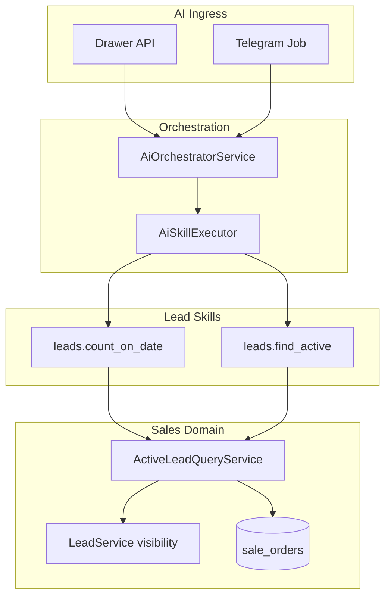

# План: AI skills для лидов (Sales)

**Статус:** запланировано, к реализации позже.  
**Зависимости:** [ai-assistent-plan.md](ai-assistent-plan.md) (фазы A–E), [leads-and-sale-order-material.md](leads-and-sale-order-material.md).

## Цель

Добавить skills ассистента для работы с лидами:

| Группа | Сценарии |
|--------|----------|
| Подсчёт | Сколько лидов **сегодня**; сколько лидов **на дату** |
| Поиск активного лида | По имени и/или фамилии, по телефону, по адресу |

**Активный лид** — лид **без** завершённого заказа (`sale_orders.status = confirmed`). При нескольких совпадениях — список до **N** (по умолчанию 5) для уточнения у пользователя.

### Принятые решения (2026-05-18)

| Вопрос | Решение |
|--------|---------|
| Завершённый заказ | Только `sale_orders.status = confirmed` (как в `SalesContractService`) |
| Несколько совпадений | Список до N (default 5), не один «последний» |

---

## Контекст и ограничения модели

| Тема | Факт в коде | Решение для skills |
|------|-------------|-------------------|
| Поля лида | `Lead`: `contact_name`, `primary_phone_snapshot`, phones morph; **нет колонки address** | Имя/телефон — на лиде; адрес — через `customer → Person/Company → locations` (+ `passport_address` у Person) |
| «Завершённый заказ» | `sale_orders.status = confirmed` | Лид **неактивен**, если есть non-deleted заказ с `status = confirmed` |
| «Активный лид» | Нет в домене | Среди лидов без confirmed-заказа, с фильтром поиска и visibility, `ORDER BY id DESC`, limit N |
| Видимость | `LeadService::applyLeadListScope` | `view any leads` → все в тенанте; иначе `author_id` / `owner_id` |



---

## 1. Доменный слой (источник истины)

Новый сервис **`App\Services\Sales\Lead\ActiveLeadQueryService`** — вся бизнес-логика «активности» и поиска **вне** handlers.

### 1.1. Определение «активный»

```php
// Псевдо-scope на Builder leads
whereNotExists(
  sale_orders where lead_id = leads.id
    and status = 'confirmed'
    and deleted_at is null
)
```

Дополнительно (как в списке UI): исключать `status = draft`, если не передан явный флаг (`Lead::scopeFilterBy`).

Опционально на модели `Lead`: `saleOrders(): HasMany` — упростит запросы и тесты.

### 1.2. Методы сервиса

| Метод | Назначение |
|-------|------------|
| `countOnDate(CarbonInterface $date, User $actor): int` | Лиды с `DATE(created_at) = :date` в TZ приложения, с `applyLeadListScope` |
| `findActive(ActiveLeadSearchDTO $search, User $actor): ActiveLeadSearchResultDTO` | Поиск + active scope + sort `id DESC` + `limit` (default 5, max 10) |

**`ActiveLeadSearchDTO`** (минимум одно поле):

- `first_name?`, `last_name?` — токены в `contact_name` / `customer.name` (порядок не важен)
- `phone?` — нормализация цифр как в `scopeFilterBy` (+ morph `phones`)
- `address?` — LIKE по `locations.address`, `locations.full_address`, `persons.passport_address`
- `limit?`

**`ActiveLeadSearchResultDTO`:** `items[]`, `total_matched`, `truncated`.

### 1.3. Поиск по адресу (ограничение)

Лиды **без `customer_id`** по адресу **не находятся**. В ответе ассистента — явная подсказка указать телефон/имя или привязать клиента.

```
leads.customer_id → customers → customerable (Person|Company)
  → locations (address, full_address)
  → Person.passport_address
```

### 1.4. Подсчёт «сегодня» / «на дату»

Один skill **`leads.count_on_date`**:

- `date` (ISO `YYYY-MM-DD`, optional) — default сегодня в `config('app.timezone')`
- Считать по **`leads.created_at`**
- Уважать `applyLeadListScope`

---

## 2. Контракт AI skills (2 tools)

| Code | Handler | Risk | Описание для LLM |
|------|---------|------|------------------|
| `leads.count_on_date` | `CountLeadsOnDateSkillHandler` | `read` | «Сколько лидов сегодня», «сколько лидов на дату» |
| `leads.find_active` | `FindActiveLeadsSkillHandler` | `read` | Поиск активных лидов: `first_name`, `last_name`, `phone`, `address` (≥1), `limit` |

Путь handlers: `app/Services/AI/Skills/Handlers/Sales/Leads/`.  
Паттерн: `ListMyTasksSkillHandler` — DI доменного сервиса, `Auth::setUser($context->actor)`, компактный JSON (не полный `LeadResource`).

### Input schema (черновик)

**`leads.count_on_date`**

```json
{
  "type": "object",
  "properties": {
    "date": { "type": "string", "format": "date", "description": "Дата создания лида; по умолчанию сегодня" }
  },
  "additionalProperties": false
}
```

**`leads.find_active`**

```json
{
  "type": "object",
  "properties": {
    "first_name": { "type": "string" },
    "last_name": { "type": "string" },
    "phone": { "type": "string" },
    "address": { "type": "string" },
    "limit": { "type": "integer", "minimum": 1, "maximum": 10 }
  },
  "minProperties": 1,
  "additionalProperties": false
}
```

---

## 3. Права (обязательный рефакторинг)

Сейчас `AiSkillExecutor::authorizeRisk` мапит read → `view tasks` — для лидов это даёт `permission_denied` (в т.ч. Telegram без middleware `branches`).

**`App\Services\AI\Skills\AiSkillPermissionResolver`:**

- `leads.*` + read → `view leads` **или** `view any leads` (как `LeadPolicy`)
- `tasks.*` — текущая матрица

Использовать `hasPermissionTo` + try/catch `PermissionDoesNotExist`. В webhook — `UserActingContext` (уже есть для Telegram).

---

## 4. Сидер, агент, кэш

1. `AiSkillsTableSeeder` — 2 записи, `domain: sales`, `is_system: true`.
2. `AiTenantBootstrapService::syncSystemSkillsForAgent()` — идемпотентно для существующих агентов.
3. После publish skills — инвалидация кэша `AiSkillRegistry` по profile.

---

## 5. UX оркестратора (опционально, после MVP)

`LeadCountQuestionDetector` + direct bypass в `AiOrchestratorService` (аналог `TaskListQuestionDetector`) — не блокирует MVP.

---

## 6. Локализация

Ключи в `lang/ru/ai.php` или `lang/ru/sales.php`: ответы с `trans_choice`, «не найдено», «список активных», ошибки критериев/адреса без customer.

---

## 7. Тесты

| Уровень | Файл | Сценарии |
|---------|------|----------|
| Unit | `tests/Unit/Sales/ActiveLeadQueryServiceTest.php` | active vs confirmed; draft; count by date; name/phone/address |
| Feature | `tests/Feature/AI/AiLeadSkillsTest.php` | Sanctum, tool через conversations API, tenant isolation |

---

## 8. Порядок реализации

1. `ActiveLeadQueryService` + DTO + unit-тесты
2. `Lead::saleOrders()` (опционально)
3. `AiSkillPermissionResolver` + правка `AiSkillExecutor`
4. Handlers + `HANDLER_MAP` + seeder + bootstrap sync
5. Feature AI tests; ручная проверка drawer/Telegram (`php artisan queue:restart` в dev)
6. (Опционально) direct bypass для count

---

## 9. Риски

- Адрес только через клиента.
- TZ «сегодня» — `app.timezone` до появления tenant TZ.
- Статусы `converted` / `lost` не закрывают лид автоматически — только confirmed order.
- Роль ассистента: `view leads` или `view any leads`.

---

## Трек исполнения

- [ ] **L.1** `ActiveLeadQueryService` + DTO + unit-тесты
- [ ] **L.2** `AiSkillPermissionResolver` + `AiSkillExecutor`
- [ ] **L.3** Handlers `CountLeadsOnDate`, `FindActiveLeads` + `HANDLER_MAP`
- [ ] **L.4** Seeder + `syncSystemSkillsForAgent`
- [ ] **L.5** Feature `AiLeadSkillsTest` + lang
- [ ] **L.6** (Опционально) `LeadCountQuestionDetector` + bypass

---

## Связанные документы

- [ai-assistent-plan.md](ai-assistent-plan.md) — мастер-план AI-платформы
- [leads-and-sale-order-material.md](leads-and-sale-order-material.md) — домен лидов и заказов
- `erp.local/docs/infrastructure/queue-workers-dev.md` — очереди и Telegram в dev
- `erp.local/docs/domains/communications/telegram-bot-provider.md` — webhook и привязка бота
