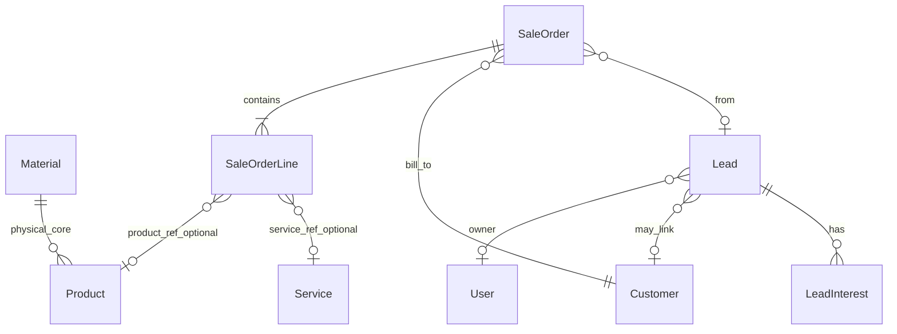
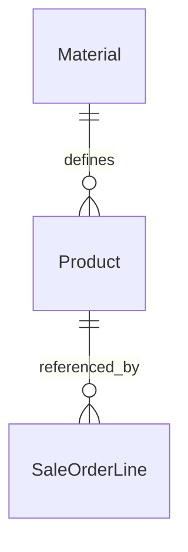
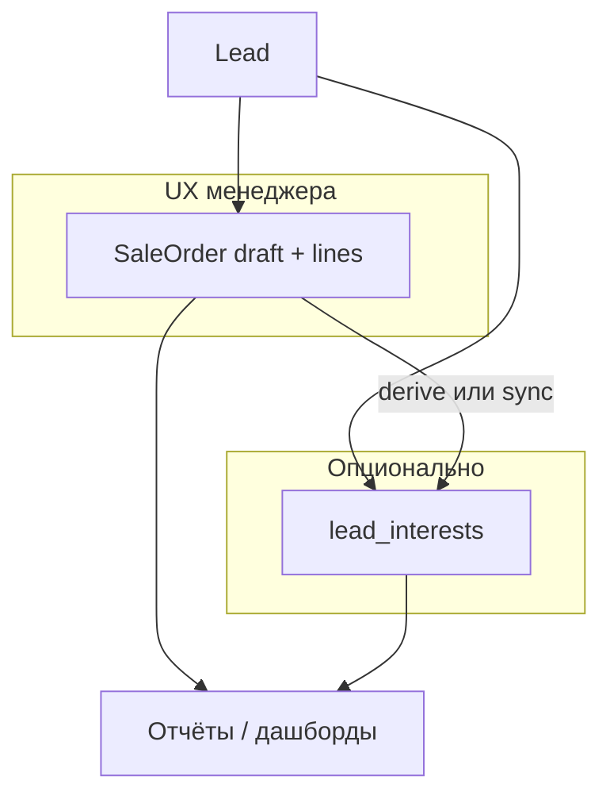

# План: лиды, заказ продаж и материальное ядро

**Статус:** план к реализации с учётом текущего кода. Референс по старой системе: [docs/old-system-for-references](../old-system-for-references) — наблюдения, не копия схемы.

## Зафиксированные имена (код и БД)

| Слой | Имя | Примечание |
| ---- | --- | ---------- |
| Модель PHP | `SaleOrder` | Не голый `Order` — меньше путаницы с purchase/work orders и зарезервированными словами SQL. |
| Таблица | `sale_orders` | В модели при необходимости явно `protected $table = 'sale_orders';`. |
| Модель PHP | `SaleOrderLine` | Строка заказа (услуга / товар), snapshot цен и при необходимости веса. |
| Таблица | `sale_order_lines` | FK: `sale_order_id`. |
| Модель PHP | `Material` | Единое физическое ядро (масса, объём, единицы измерения). |
| Таблица | `materials` | Уже в проекте. |
| Модель PHP | `Product` | Продаваемая номенклатура; `material_id` → `materials`. |
| Таблица | `products` | Уже в проекте. |

**Не использовать** без уточнения домена: голые `orders`, `order_items` — размытый смысл и пересечение с SQL `ORDER`.

---

## Как это обычно устроено в индустрии

- **CRM**: *Lead* → квалификация → *Contact/Account*, часто *Opportunity* → *Quote* / *Order*.
- **ERP**: интерес, коммерческий документ и исполнение (отгрузка, счёт, склад) — разные модули и статусы.

**Вывод:** *Lead* — контакт и интерес до полноценного клиента. *SaleOrder* — коммерческий документ со **строками** (услуги + товары). Оплата, склад, отгрузка — следующие этапы.

---

## Что уже есть в проекте (актуальная база под план)

### Продажи и клиент

- **Клиент:** `App\Models\Sales\Customer` — morph `Person` / `Company`, `HasCompany`, `HasBranch`, `source_id` → `CustomerSource`, метрики в `CustomerMetrics` (`orders_count`, даты заказов и т.д.) — **заказы должны обновлять метрики при переводе в подтверждённый статус** (отдельный шаг в сервисе `SaleOrder`).
- **Каталог услуг:** `App\Models\Sales\Catalog\Service` — пригоден для `SaleOrderLine` с `line_type = service`.
- **Каталог товаров:** `products` + `Product` с `material_id`, `manufacturer_id`, SKU, категория, наборы — **справочник товаров для v1 уже есть**, строки заказа могут ссылаться на `product_id` + snapshot.
- **Материалы:** `materials` + `Material` — сейчас в БД: `weight`, `unit_weight_id`, `volume`, `unit_volume_id` (не отдельные `*_kg` в колонках; snapshot в строках заказа проектируем под эту модель или нормализуем в сервисе пересчёта).
- **Паттерны реализации:** эталон **Company** (Controller + Request + DTO + Service + Policy + `responseWithEntityMeta` на index); агрегаторы **Vendor / Customer / Manufacturer** (lifecycle-create, morph, отдельные PUT на субъект + на агрегат) — для **Lead** при необходимости «создать персону/компанию на лету» можно опереться на те же сервисы, но MVP лида может обойтись полями контакта на самом лиде.

### Инфраструктура проекта

- **Миграции:** правки только в **исходных** `create_*` там, где таблица ещё «наша» и стенд перекатывается; не плодить `*_add_*` без необходимости (см. `.cursorrules`).
- **Сущности:** регистрация в **EntitySeeder**, права Spatie + **ветки** (`BranchesPermission`), политики в **AuthServiceProvider**.
- **Опциональные строки:** `App\Support\Strings\StringNormalizer::nullableTrim` для кодов/описаний по мере ввода полей.
- **API:** группа `sales` + `auth:sanctum`, `refine-tenant-context`, `company-external-access`, `branches` — новые маршруты лида/заказа размещать **в той же зоне**, что и клиенты/каталог (префикс и middleware согласовать с `routes/api.php`).

### Телефоны / Person

- Для лида «только телефон» в MVP: либо поля на `leads`, либо связь с **Person** + нормализация через существующие сервисы телефонов — решение на этапе 0 (см. ниже).

---

## Доменная модель (черновик)

### 1) `Lead` (MVP)

- Контакт: телефон (E.164 / нормализация), опционально имя, email.
- Интересы: 1..N через `LeadInterest`.
- Владение: `company_id`, `branch_id`, автор/редактор (`author_id` / `editor_id`), **ответственный менеджер** — `owner_id` nullable FK `users`, `onDelete('set null')` (не путать с автором записи).
- Статус: справочник или коды (`new`, `contacted`, `qualified`, `converted`, `lost`).
- Опционально `customer_id` после конвертации.
- Источник: **переиспользовать `customer_sources`** (`CustomerSource`) через `source_id`, если семантика совпадает; иначе отдельный справочник лидов.

**Не в MVP лида:** полный UTM-блок — фаза 2 (JSON `attribution` или сущность `LeadAttribution`).

### 2) `LeadInterest`

- **Полиморфная ссылка на номенклатуру** (как в проекте принято): `interestable_type` + `interestable_id` с алиасами в `Relation::morphMap` — **`service`** (`App\Models\Sales\Catalog\Service`) и **`product`** (`App\Models\Sales\Catalog\Product`). Оба поля **nullable**: интерес может существовать **без** привязки к услуге или товару.
- **Текст интереса** — отдельное поле (например `note` или `title`): свободное описание («интересуют окна», «уточнит по каталогу»). Так можно сохранить строку, когда в каталоге ещё нет подходящей позиции.
- **Валидация (рекомендация для MVP):** достаточно **либо** непустого текста, **либо** заполненного morph (ровно один тип + id), **либо** и текст, и ссылка вместе (удобно для поиска и отчётов). Запретить одновременно **два** разных смысла не нужно: morph максимум один объект, текст опционален.
- Индекс по паре `(interestable_type, interestable_id)` как у других morph-таблиц.

### 3) `SaleOrder`

- Жизненный цикл (упрощённо): `draft` → `confirmed` → позже `fulfilled` / `invoiced` / `cancelled`.
- Суммы: `currency_id`, `subtotal`, `discount_total`, `tax_total`, `total` — пересчёт из строк (отдельный метод сервиса; MVP: скидки на строке + одна скидка на документ).
- Связи: `customer_id` (обязателен для подтверждённого заказа по бизнес-правилам), `lead_id` nullable.
- **Основной черновик по лиду:** флаг **`is_primary`** (имеет смысл при `status = draft` и заполненном `lead_id`). **На один `lead_id` не более одного** заказа с `is_primary = true` среди `draft` (уникальность на уровне БД — partial unique index или проверка в сервисе). Проекция намерений и UI «текущий состав» всегда читают **строки этого** черновика.

### 4) `SaleOrderLine`

- `line_type`: `service` | `product`.
- `service_id` / `product_id` nullable по типу.
- **Снимок:** `name`, `quantity`, единица (id или код), `unit_price`, `line_total`, налоги — чтобы каталог не ломал историю.
- Опционально snapshot веса: агрегат по строке (например `line_gross_weight`) из `Product` → `Material` с учётом `weight` + `unit_weight_id` и количества (конкретные имена колонок — в миграции строки заказа).

**v1 и каталог:** товары и материалы **уже есть** — не требуется режим «только услуги без product_id»; при необходимости черновик с произвольным текстом — отдельное решение (snapshot без FK).

---

## `Product` и `Material` (фактическая схема vs расширения)

**Сейчас в БД (`materials`):** `company_id`, `name`, `weight`, `unit_weight_id`, `volume`, `unit_volume_id`, авторы, soft deletes.

**Сейчас в БД (`products`):** `company_id`, `category_id`, `material_id`, `unit_id`, `sku`, `name`, `is_bundle`, `display`, `system`, `manufacturer_id`, …

Документ ниже с «gross_weight_kg / габариты» — **целевое обогащение** материала, если понадобится для логистики; вынести в отдельную подзадачу **после** MVP заказа или расширить начальную миграцию `materials` по правилам проекта, если команда перекатывает БД.

---

## Логический пример колонок (новые таблицы)

### `leads` / `lead_interests`

Как в разделах **Lead** и **LeadInterest** выше: у лида — `owner_id`; у интереса — nullable morph + текст, без обязательной ссылки на товар/услугу (конкретные имена колонок и FK — в миграции).

### `sale_orders`

| Колонка | Назначение |
| ------- | ---------- |
| `id` | PK |
| `company_id`, `branch_id`, `customer_id`, `lead_id` (nullable) | |
| `is_primary` | Только для `draft` + `lead_id`: единственный «рабочий» черновик лида |
| `status`, `currency_id`, агрегаты сумм | |

### `sale_order_lines`

| Колонка | Назначение |
| ------- | ---------- |
| `id` | PK |
| `sale_order_id` | FK |
| `line_type` | `service` / `product` |
| `service_id` / `product_id` | по типу |
| snapshot цен, имён, единиц | |
| опционально поля snapshot веса | см. `Material`/`Product` |

**Зачем snapshot веса:** изменение `materials` не должно менять исторические заказы. При `confirmed` — заполнять из `Product` → `Material`; в черновике можно показывать «живой» расчёт.

### Пример: вес товарных строк

**Живой** (черновик): join `sale_order_lines` → `products` → `materials`.

**Snapshot** (подтверждённые): сумма snapshot-полей по строкам с `line_type = product`.

---

## Архитектура: черновик заказа — основной UX, интересы не дублируют работу менеджера

Цель: сохранить сценарий **«сразу набрали товары/услуги в черновик → согласовали → Оформили»**, не заставляя менеджера **параллельно** вести отдельный список интересов. При этом **LeadInterest** остаётся полезным для ранней стадии и отчётности.

### Принципы

1. **Источник истины во время разговора** — **`SaleOrder` со статусом `draft`** и его **`SaleOrderLine`** (как в старой системе). Менеджер не обязан заполнять `LeadInterest`, если уже ведёт черновик заказа.
2. **`LeadInterest`** — **опциональный слой**: (а) лид без заказа — «о чём спрашивали» текстом и/или morph; (б) при необходимости **снимок/копия** для истории или отчётов, если не хотите строить отчёты только через join к заказам.
3. **Связь** `sale_orders.lead_id` (nullable) — черновик и подтверждённые заказы привязаны к лиду, когда лид создан **до** или **параллельно** продажам.

### Откуда брать «что спрашивали / что обсуждали» для отчётов

| Ситуация | Источник для аналитики |
| -------- | ---------------------- |
| Есть **черновик или любой заказ** с `lead_id` | **Строки заказа** (`SaleOrderLine`): тип, ссылка на product/service, snapshot-имя, количество. Это и есть каноническое описание номенклатуры в работе. |
| Заказа ещё **нет**, только лид | Только **`lead_interests`** (и поля контакта на лиде). |
| Нужны **единый контракт** для BI/дашборда без ветвления в каждом отчёте | Ввести **сервис чтения** (например `LeadIntentProjection` / query object), который возвращает **нормализованный список «позиций намерения»**: либо из интересов, либо **деривативно** из строк **активного черновика** (см. ниже). |

**Деривативно из черновика (без дублирования в БД):**  
При запросе «текущее намерение по лиду X» сервис берёт **`SaleOrder`** с `lead_id = X`, `status = draft`, **`is_primary = true`** и маппит строки в DTO (аналог интереса): `line_type` → morph-тип, `product_id`/`service_id`, текст из snapshot `name`, `quantity`.

Так **интересы не обязаны** совпадать со строками вручную — отчёт «как в старой системе» строится **по строкам черновика**.

### Опционально: материализация интересов из черновика (если удобнее хранить)

Если отчётным проще иметь **физические строки** в `lead_interests`:

- По событию **`SaleOrder` saved** (только `draft`) или по кнопке **«Синхронизировать с лидом»** вызывать **`LeadInterestSyncFromDraftService`**: пересобрать интересы из строк (стратегия **replace** по `lead_id` или помечать источник `synced_from_sale_order_id`, чтобы не смешивать с ручными).
- Либо **один раз при `confirmed`**: заморозить «картину намерений» в `lead_interests` для аудита (**снимок на момент оформления**), не требуя этого от менеджера в UI.

Во всех случаях **UI по умолчанию** — один экран **черновика заказа**; синк в интересы **фоновый или по событию**, не обязательный для работы менеджера.

### Несколько черновиков на один лид

**Решение:** у лида может быть несколько `draft` (например старый снятый с primary), но **ровно один** с **`is_primary = true`** — он и есть источник «текущего» состава для CRM и отчётов «что обсуждаем сейчас». Снятие primary с прежнего черновика и назначение другому — явная операция (или создание нового primary и сброс флага у старого).

### Когда делать слепок намерений (если нужна история «сначала спрашивали одно, потом пошли в другую сделку»)

**Важно разделить два смысла:**

| Что нужно | Где живёт данные |
| --------- | ---------------- |
| **Текущий** состав переговоров | Строки **основного** черновика (`is_primary`) — обновляются **каждым** запросом add/update/delete строки. **Отдельный слепок здесь не нужен:** это и есть актуальное состояние. |
| **История** смены направления (отчёт «что спрашивали **до** того, как состав поменяли / до заказа») | Не путать с каждым PATCH строки: правка количества или замена одной позиции — не то же самое, что «ушли в другую сделку». Нужны **явные точки фиксации** или **отдельная таблица снимков**. |

**Не делать слепок автоматически на каждое изменение строк** — история раздуется, не отличите «подправили черновик» от «сменили ветку сделки».

**Рекомендуемые моменты слепка для истории (выбрать один или комбинировать):**

1. **При переводе заказа в `confirmed`** — обязательный **бизнес-слепок** уже в **`SaleOrderLine`** (snapshot полей). Это ответ на вопрос «что в итоге купили/оформили», а не обязательно все промежуточные варианты.
2. **Ручная фиксация (рекомендуется для сценария «пошли в другие товары»):** действие **«Зафиксировать состав»** на карточке лида/черновика — перед тем как менеджер **существенно** пересобирает список (другая сделка). Сервис копирует текущие строки **основного** черновика в **`lead_intent_snapshots`** (или аналог): `lead_id`, `sale_order_id`, `captured_at`, `trigger = manual`, **payload** (JSON массива строк: типы, id, имена, количества). Так в отчёте видно «вариант A до пивота».
3. **Опционально позже:** при **смене этапа лида** (воронка) — настраиваемый автослепок того же вида (`trigger = stage_change`, `from_stage` / `to_stage`), если продуктово нужно «срез по воронке» без кнопки.

**Про `lead_interests`:** для **истории пивотов** удобнее **отдельная сущность снимков** (append-only), а не перезапись `lead_interests` — иначе смешиваются «живые» ранние интересы без заказа и «архив состава». Материализация интересов из черновика (раздел выше) остаётся **опциональной** для отчётов без join; **история** — через снимки или подтверждённые заказы.

### UX снимков: несколько фиксаций, выбор по времени, просмотр, восстановление в основной черновик

**Идея продукта:** кнопка **«Зафиксировать состав»** доступна **много раз**; в UI — **выпадающий список / селектор** снимков (сортировка по `captured_at`, подпись: дата-время + опционально комментарий менеджера); **просмотр** выбранного слепка **только для чтения**; при необходимости — **«Применить к основному черновику»** (импорт / замена строк).

**Плюсы**

- **Прозрачная история переговоров** — несколько вариантов состава без потери контекста «что предлагали на этапе X».
- **Снижение страха менять черновик** — перед пивотом зафиксировали, дальше можно смело пересобирать строки.
- **Восстановление после ошибки** — случайно очистили список или удалили важную строку: можно поднять прошлый слепок (с оговорками ниже).
- **Единый паттерн для отчётов** — список снимков = готовые «точки во времени» для BI (фильтр по `lead_id`).

**Минусы и риски**

- **Операция «заменить основной черновик из слепка» деструктивная** — текущие строки теряются (если не делать отдельный слепок «до отката»). Нужны: **модальное подтверждение**, текст про перезапись, опционально **авто-слепок текущего состава перед применением** старого.
- **Семантика «импорт» vs «замена»:** **замена** = удалить все строки primary draft и создать из payload; **импорт/добавить** = добавить строки к существующим (риск дублей) — в UI лучше явно два действия или одно с радио «полностью заменить / добавить к текущему».
- **Устаревшие ссылки в payload:** товар снят с продажи — при **просмотре** показывать **snapshot-имена и количества из JSON**; при **применении** — валидация: предупреждение или запрет строк с «битым» `product_id`/`service_id` (политика продукта).
- **Объём данных:** частые фиксации без дисциплины раздувают таблицу — позже можно **лимит на лид**, архив или мягкое правило «комментарий обязателен» (опционально).
- **Одновременное редактирование:** два менеджера — слепок и правки могут рассинхрониться; достаточно **optimistic locking** по `sale_orders.updated_at` или предупреждение при применении слепка.
- **Путаница с подтверждённым заказом:** восстановление из слепка имеет смысл **только для `draft`**; для `confirmed` слепок в строках заказа не перезаписывать из UI снимков лида.

**Рекомендации по реализации (кратко)**

- Таблица снимков: `lead_id`, `sale_order_id` (какой черновик снимали), `captured_at`, `author_id`, опционально `note`, `payload` (JSON), `trigger` (`manual` / позже `stage_change`).
- API: `POST` создать снимок с текущих строк primary; `GET` список для лида; `GET :id` тело для просмотра; `POST :id/apply-to-primary` с телом `{ mode: replace | merge }` и проверками выше.
- UI: селектор по времени; панель предпросмотра; кнопка применения — вторичная, с подтверждением.

### Согласованность с этапами внедрения

- **Этап 1 (Lead + LeadInterest):** интересы — для лидов **без** заказа; API и списки.
- **Этап 2 (SaleOrder + строки):** основной сценарий менеджера; `lead_id` на заказе; сервис **проекции намерений** (чтение из черновика) можно ввести сразу или сразу после CRUD заказов.
- **Этап 3 (конвертация):** кнопка «Оформить» = смена статуса + snapshot строк; опционально снимок в интересы.

### Краткая схема потоков данных

---

## Процесс Lead → Customer → SaleOrder

1. Создать `Lead` (контакт, `owner_id`, источник).
2. Квалификация: при необходимости **Customer**, `lead.customer_id`.
3. **Основной сценарий продаж:** создать **`SaleOrder` в `draft`** с `lead_id`, сразу добавлять **строки** (товары/услуги) — как в старой системе. **`LeadInterest` не обязателен.**
4. Опционально: ранний лид **без заказа** — только **`LeadInterest`** + текст; позже создать черновик заказа и при желании перенести/синхронизировать.
5. **Оформить заказ:** перевод `draft` → `confirmed` (и далее по жизненному циклу), snapshot строк; лид → `converted` при необходимости.
6. Несколько заказов на один лид допустимо (`lead_id` не unique).

---

## Сущности после MVP (по необходимости)

| Сущность | Зачем |
| -------- | ----- |
| Opportunity / Deal | Воронка с вероятностью до заказа. |
| Quote отдельно | Несколько КП без «фейкового» заказа; иначе `draft` = КП. |
| Склад, оплаты, счета | Отдельные контексты. |

---

## Этапы разработки (с учётом подготовки)

### Этап 0 — решения (перед кодом)

| Вопрос | Варианты |
| ------ | -------- |
| КП vs заказ | Отдельная сущность **Quote** или **`sale_orders.status = draft`** как КП. |
| Контакт лида | Только поля на `leads` в MVP или сразу связь с **Person** + телефоны проекта. |
| Источник | Только **`customer_sources`** или отдельный справочник. |
| Налоги / валюта | Одна валюта на документ в MVP; налоги — заглушка или процент на строке. |
| Обновление метрик | При каком статусе `SaleOrder` писать в `CustomerMetrics` (рекомендация: **`confirmed`**). |
| Основной черновик | **`is_primary`** на `sale_orders` для `draft` + `lead_id`; не более одного primary на лид. |
| История состава до пивота | **Снимки** (`lead_intent_snapshots` или имя по конвенции проекта) по кнопке **«Зафиксировать состав»**; автослепок на каждую строку — **нет**; при **`confirmed`** — история в строках заказа. |

Зафиксировать ответы в этом файле или в задаче трекера.

### Этап 1 — Lead + LeadInterest

- Миграции: `leads` (в т.ч. `owner_id` → `users`), `lead_interests` (`interestable_type` / `interestable_id` nullable + текст `note`/`title`, индекс по morph) — новые **начальные** `create_*`.
- Зарегистрировать алиасы **`service`** и **`product`** для morph интереса в `morphMap`, если ещё не покрывают `LeadInterest` (сверить с `AppServiceProvider`).
- Модели: `App\Models\Sales\Lead`, `App\Models\Sales\LeadInterest` — `HasCompany`, `HasBranch`, `HasAuthorEditor`, `SoftDeletes`, `Sortable` по аналогии с `Customer`; у интереса — `morphTo('interestable')`.
- Стек: **LeadController**, Request, DTO, **LeadService**, **LeadPolicy**, маршруты в `routes/api.php` (группа `sales`), **EntitySeeder** + permissions.
- Фронт: `pages/sales/leads/` (index / create / edit) по зрелому образцу (`customers`, `vendors`), axios + `useNotify`, табы при необходимости.

### Этап 2 — SaleOrder + SaleOrderLine

- Миграции: `sale_orders` (в т.ч. `lead_id`, **`is_primary`**, правило уникальности primary draft на лид), `sale_order_lines`.
- Опционально в той же фазе или следом: таблица **`lead_intent_snapshots`** + endpoint/действие **«Зафиксировать состав»**, если история пивотов нужна в первом релизе заказов.
- Модели + сервис пересчёта сумм и валидация строк (тип + FK + тенант).
- API + Policy; индекс с `responseWithEntityMeta`.
- UI: карточка заказа, таблица строк, добавление услуги/товара из каталога.
- **Интеграция:** обновление `CustomerMetrics` при подтверждении (и откат при отмене — по политике продукта).

### Этап 3 — конвертация Lead → SaleOrder

- Сервис / endpoint: создать черновик заказа с `lead_id`, проставить `customer_id`, опционально перенести `LeadInterest` в строки.
- Статус лида `converted`, аудит по желанию.

### Этап 4 — расширения

- UTM / attribution, дедупликация лидов, налоги, счета, склад, расширение **Material** (габариты и т.д.).

---

## Риски и упрощения

- Глобальный класс `Order` в PHP избегать; доменное имя — `SaleOrder`.
- Старый estimate смешивал слишком много — границы контекстов держать явными.
- Связь лида с существующим `Customer` важнее дублирования legacy-полей.
- Не дублировать **Manufacturer/Company**-поля на сущностях, где данные уже в morph-карточке (принцип недавнего рефакторинга производителя).

---

## Итог

Две новые опорные сущности (**Lead** + **SaleOrder**), строки **SaleOrderLine**. **Product** и **Material** уже в проекте — строки заказа опираются на каталог с **snapshot** для цен и при необходимости веса. Детализация миграций и UI — после прохождения **этапа 0** и регистрации в backlog.
